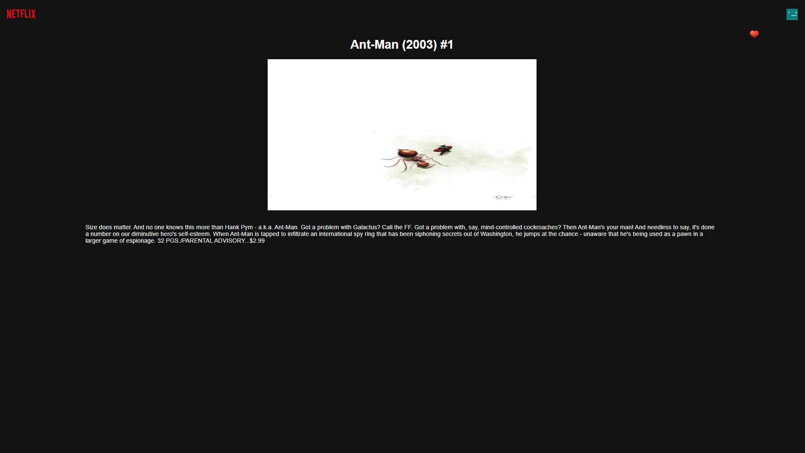

# Marvel Comics Uygulaması

Bu uygulama, Marvel Comics API'sini kullanarak Comics verilerini listeleyen ve Comic detaylarını gösteren bir Vue.js uygulamasıdır. Uygulama, Vue framework'ünü kullanmakta ve Vuex state yönetimiyle veri saklamaktadır.

## Özellikler

- Comics listesi: İndex sayfasında, Marvel Comics API'sinden çekilen veriler kullanılarak Comics başlığındaki verileri listeler. Her bir Comic için aşağıdaki bilgiler gösterilir:
  - Başlık (title)
  - Açıklama (description)
  - Kapak resmi (thumbnail)
  - Yaratıcılar (creators)

- Favorilere ekleme: Her bir Comic itemi için favorilere ekleme işlemi yapılabilir. Header kısmında bulunan favori ikonu kullanılarak Comic itemi favorilere eklenir. Favori ikonu üzerindeki badge alanında, favorideki Comic sayısı gösterilir.

- Comic detayları: Comic itemine tıklandığında, ayrı bir Comic detay sayfasına yönlendirilir. Bu sayfada, seçilen Comic'in detayları gösterilir. Tasarım açısından herhangi bir sınırlama yoktur, ancak bütünlüklü ve kullanıcı dostu bir tasarım tercih edilmelidir.

## Gereksinimler

- Node.js
- Vue.js
- Vuex
- Sass
- axios veya benzeri bir HTTP kütüphanesi

## Kullanılan Teknolojiler

- Vue.js
- Vuex
- Sass
- Vue Router
- axios

## Ekran Görüntüleri
Ana Sayfa

Detay Sayfası


## Kurulum

1. Depoyu klonlayın:

   ```
   git clone <repository_link>
   ```

2. Proje dizinine gidin:

   ```
   cd marvel-comics-app
   ```

3. Bağımlılıkları yükleyin:

   ```
   npm install
   ```

4. `.env` dosyasını oluşturun ve aşağıdaki değişkenleri doldurun:

   ```
   VUE_APP_API_BASE_URL=http://gateway.marvel.com/v1/public/
   VUE_APP_API_KEY=<Marvel_API_Key>
   VUE_APP_HASH=<Marvel_API_Hash>
   ```

   Not: `<Marvel_API_Key>` ve `<Marvel_API_Hash>` değerlerini kendi Marvel Developer Portal hesabınızdan almalısınız.

5. Uygulamayı başlatın:

   ```
   npm run serve
   ```

6. Tarayıcınızda uygulamaya aşağıdaki URL'yi girerek erişebilirsiniz:

   ```
   http://localhost:8080/
   ```

